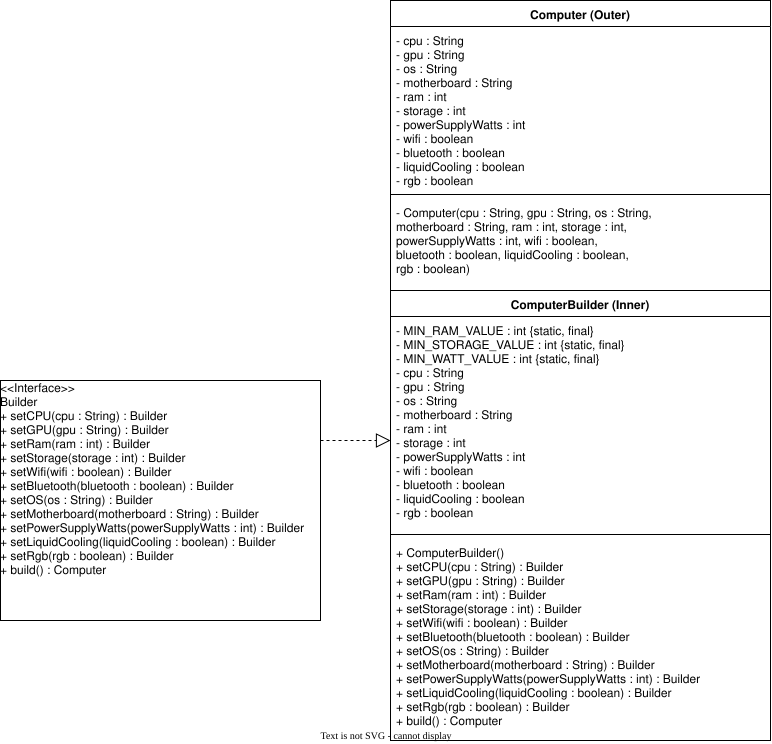
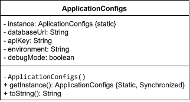

# WORK IN PROGRESS !!!

# Design Patterns in Java

Instead of just reading about each pattern, I wanted to actually sit down and implement all of them in Java. The goal was to get a 
better feel for how each pattern works, what problem it's trying to solve, and what the implementation actually looks like in practice.

Each pattern has its own implementation using standard Java classes and interfaces, with no additional frameworks or libraries.

## Patterns Covered

The repository includes implementations of all 23 classic GoF patterns across three categories:

- Creational Patterns — 5 patterns

- Structural Patterns — 7 patterns

- Behavioral Patterns — 11 patterns

This repository is primarily a learning exercise and a reference for revisiting design patterns through working code.

# UML Diagrams

I've also put together UML diagrams for each pattern implementation.

The idea here is to have both the code and the conceptual view of each implementation readily available. 
The Java code shows the actual implementation, while the UML diagrams make it easier to see how the pieces fit together and how the pattern is structured.

## Creational Patterns
 Patterns that focus on streamlining the object creation portion of programming, giving you more 
 flexibility in how objects come into existance
### Abstract Factory
- Purpose/intent:
- Ideal usage:
<!-- Add Abstract Factory UML diagram here -->
### Builder
- Purpose/intent: pattern that separates the construction process of a complex object from its representation, allowing different variations of an objects to be made from the same construction process
- Ideal usage: when constructing and object requires a lot of parameters and many are optional

| Pros                                             |                                                                             Cons |
|:-------------------------------------------------|---------------------------------------------------------------------------------:|
| - promotes separation of object creation and use |                                                      increased code complexity - |
| - enhanced object configurability                | potential for inconsistency because of the flexibility of the building process - |
| - improved code readability                      |                                                                                  |

### Factory Method
- Purpose/intent:
- Ideal usage:
<!-- Add Factory Method UML diagram here -->

### Prototype
- Purpose/intent:
- Ideal usage:
<!-- Add Prototype UML diagram here -->

### Singleton
- Purpose/intent: Pattern ensures class has only 1 instance and provides a global access point to itself
- Ideal usage: when it makes logical sense for there to be one instance of something (i.e. "will having two of these cause problems?")

| Pros                                                        |                                                                         Cons |
|:------------------------------------------------------------|-----------------------------------------------------------------------------:|
| - provides a single well defined entry point to an instance |                                          Testing may require complex setup - |
| - excels at resource & state management                     |                     pattern can get complex in multi-threaded environments - |
| - allows for lazy initialization of resources               | often seen as an 'anti-pattern' because it tends to add complexity to code - |

## Structural Patterns
<!-- add overall Purpose of this type of pattern -->
Adapter
- Purpose/intent:
- Ideal usage:
<!-- Add Adapter UML diagram here -->
Bridge
- Purpose/intent:
- Ideal usage:
<!-- Add Bridge UML diagram here -->
Composite
- Purpose/intent:
- Ideal usage:
<!-- Add Composite UML diagram here -->
Decorator
- Purpose/intent:
- Ideal usage:
<!-- Add Decorator UML diagram here -->
Facade
- Purpose/intent:
- Ideal usage:
<!-- Add Facade UML diagram here -->
Flyweight
- Purpose/intent:
- Ideal usage:
<!-- Add Flyweight UML diagram here -->
Proxy
- Purpose/intent:
- Ideal usage:
<!-- Add Proxy UML diagram here -->
## Behavioral Patterns
<!-- add overall Purpose of this type of pattern -->
Chain of Responsibility
- Purpose/intent:
- Ideal usage:
<!-- Add Chain of Responsibility UML diagram here -->
Command
- Purpose/intent:
- Ideal usage:
<!-- Add Command UML diagram here -->
Interpreter
- Purpose/intent:
- Ideal usage:
<!-- Add Interpreter UML diagram here -->
Iterator
- Purpose/intent:
- Ideal usage:
<!-- Add Iterator UML diagram here -->
Mediator
- Purpose/intent:
- Ideal usage:
<!-- Add Mediator UML diagram here -->
Memento
- Purpose/intent:
- Ideal usage:
<!-- Add Memento UML diagram here -->
Observer
- Purpose/intent:
- Ideal usage:
<!-- Add Observer UML diagram here -->
State
- Purpose/intent:
- Ideal usage:
<!-- Add State UML diagram here -->
Strategy
- Purpose/intent:
- Ideal usage:
<!-- Add Strategy UML diagram here -->
Template Method
- Purpose/intent:
- Ideal usage:
<!-- Add Template Method UML diagram here -->
Visitor
- Purpose/intent:
- Ideal usage:
<!-- Add Visitor UML diagram here -->

# What I Learned
Implementing these patterns helped me understand a lot more about why architecture and planning matter when building software.

One of the biggest things I took away from this project was becoming much more comfortable with interfaces and with understanding 
code that someone else has written. Before starting this project, I remember coming across the Builder pattern in a library I use 
in one of my main projects, Clarity API, and being utterly confused about why I had to instantiate an object through a series of 
method calls instead of just using a constructor. After learning and implementing the pattern myself, that same kind of code makes a 
lot more sense.

Working through all 23 patterns has also broadened the way I think about programming. I have a better understanding now of how patterns 
can provide a kind of blueprint for structuring code, and how that structure can make software more flexible, scalable, and maintainable.

Something else I didn't really appreciate before this project was how much design patterns can improve the development experience. 
When you come across code that follows a pattern you recognize, you don't have to spend as much time figuring out the overall structure 
before you can start understanding the actual logic.

Overall, this project gave me a better appreciation for programming as more than just writing code that works. There's also a lot of 
thought that goes into how that code is organized, how easy it is for someone else to understand, and how well it can adapt as a project grows.

# How I Learned

I wanted this learning process to be more than just following along with examples, so I used a few different resources throughout the process,
with each one serving a different purpose.

YouTube — I used videos to learn the theory behind each design pattern and get a general understanding of what problem each pattern is trying to solve.

AI — Once I had a basic understanding of a pattern, I used AI to give me exercises and scenarios to implement myself (can be found in the main class of each design pattern as a comment at the start of the file). This gave me a way to actually practice the patterns instead of just reading about them.

Design Patterns: Elements of Reusable Object-Oriented Software — I also have the original Gang of Four (GoF) book, which I plan to read as I continue learning. My goal is to use it to go deeper into the ideas behind the patterns and better understand the reasoning that led to them.
